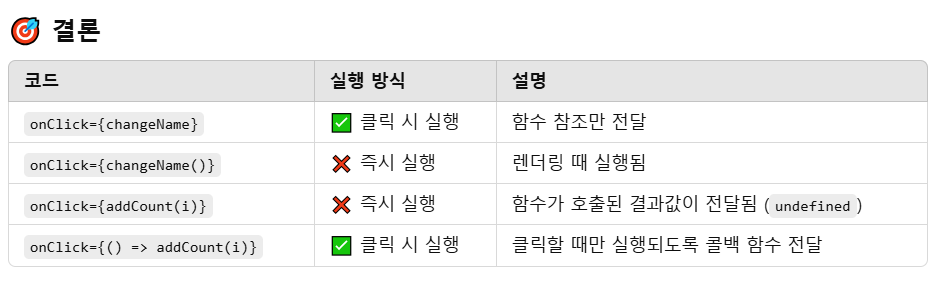
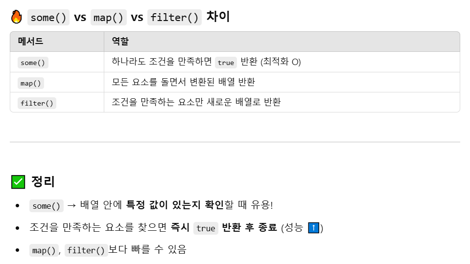

# 쇼핑몰 사이트 만들기

## 1.새로운 리액트 프로젝트 생성
리액트 프로젝트 생성은 이제 쉽게 할거라 믿는다.  

### React-Bootstrap 라이브러리 설치
레이아웃을 복붙식으로 편하게 개발가능한 라이브러리이다.  
외부라이브러리 설치 방식은 똑같다. 구글에서 라이브러리docs 사이트에 들어가 설치 및 시작에 들어간다.   
알려주는 방법 그대로 설치를 진행하면 된다. 설치명령어는 언제든 바뀔 수 있어서 docs 들어가 직접확인 필요   
```bash
npm install react-bootstrap bootstrap
```
명령어 입력뿐만 아니라 css 파일 또는 index.html 파일에 선택해서 넣으라는 것을 집어넣어준다.  

### React-Bootstrap 사용법
부트스트랩 docs에서 버튼을 검색하고 import 및 원하는 버튼을 가져다가 복붙으로 사용   

---

## 2.이미지 넣는 법
return 안에  
```jsx
<div className="main-bg"></div>
```
div 하나 넣어주고  

```css
.main-bg{
    background-image: url(./assets/pic.png);
    /* height: 600px;
    background-size: cover;
    background-position: center; */
}
```
css 파일에서 background-image 에서 url 넣고 해상 사진의 위치를 넣으면 된다.   
html 안에 넣고 싶으면   
```jsx
import bg from './assets/pic.png';

<div className="main-bg" style={{backgroundimage : 'url('+ bg +')'}}></div>
```
import를 통해서 이미지 경로를 설정 한 변수를 style을 url안에 직접 넣는다.   

### 상품 레이아웃 만들기
레이아웃으로 가로로 3개 균등하게 나우기 위해선 bootstrap에 가서 columns 혹은 grids 검색하면 잘 나온다.  
가져와서 사용하고 column 테그 안에 각각 상품명과 이미지테그를 삽입해서 사용하면 된다.  
img 테그 안에 src ="" 를 이용해서 주소를 넣는데 html안에 넣는거니까 아까처럼 import해서 넣거나 외부호스팅된 이미지라면 그냥 이미지 절대주소를 넣으면 된다.  

### public 폴더
이미지를 쓸때마다 import하면 엄청 많은 import가 생기게 된다. 그걸 해결해주는것은 public 폴더이다.  
나중에 build 할때 src 폴더는 다 압축이 되지만 public 폴더는 압축이 되지 않는다.   
pulic 폴더 안에 이미지들을 사용할려면 /로 시작해서 이름만 잘 넣어주면 알아서 잘 가져와준다.   
형태보존하고 싶은 파일은 public 안에 넣으주면 된다. 이미지 txt json 등 수정이 필요없는 static 파일 같은 것   


나중에 배포할 때 jingu0318.com 경로에 배포하면 아무런 문제가 없지만  
jingu0318.com/어쩌구/ 경로에 배포하면 /logo192.png 이렇게 쓰면 파일을 찾을 수 없다고 나올 수도 있습니다.   

```jsx
 
```
public 폴더 이미지를 사용할 때 권장하는 방식이다.   
이렇게 사용하면 문제가 해결된다.  

---

## 3.코드 길어지면 import export문법
데이터를 저장하기 위한 jsx 파일을 하나 생성한다. <mark>길고 복잡한 state는 다른 파일로 빼는게 좋다.</mark>   
이 데이터를 이용하기 위해선 import,export가 필요하다.   
타 파일에 있는 변수를 사용하고 싶다면 다른 파일에 있는 변수를 export하고 App.jsx에서 import하면 끝   

```jsx
export default 변수명;
export {변수1, 변수2}; //여러개 변수 보내고 싶을 때

import 작명 from './파일경로이름'
import {변수1, 변수2} from './파일경로이름' //여러개받을때
```

### 길고 복잡한 state 데이터바인딩
복잡한 자료에서 데이터 뽑을 땐 시작기호만 잘 보면된다.   
시작기호가 [] 대괄호로 시작하면 array 자료이다. [0] 이렇게 뽑으면 된다.   
시작기호가 {} 중괄호로 시작하면 object 자료이다. .키명 이렇게 뽑으면 된다.   


### 축약하기

1. 상품목록 컴포넌트화 
2. 컴포넌트 안 데이터바인딩 
3. 반복적인 컴포넌트 map반복문 활용하여 하나로 축약 


### 기억할 부분
map() 함수는 혼자 사용이 안되고 앞에 배열과 함께만 사용이 가능하다. 배열갯수만큼 반복   
map() 안에 function(a,i) {} 말고 (a,i) => {} 로 축약가능   
map() 함수를 나는 자식 컴포넌트 안에서 동작했지만 밖에서 돌려도 상관없다.   

---

## 4.리액트 라우터1
페이지를 나누기 위해서는 라우터가 필요하다.  
SPA인 리액트는 페이지 하나를 다른 컴포넌트로 갈아치우면서 여러 페이지를 보여주는 것 처럼 행동한다.   
페이지 갈아치우는 것을 도와주는 라이브러리가 있는데 react-router-dom 이다. 일명 라우팅을 도와주는 라이브러리다.    

### 라우터 설치 및 세팅
react-router-dom 6 사이트에서 설치과정을 따라가면 된다.

터미널에서 아래 명령어로 라우터 설치 (6버전)  
```bash
npm install react-router-dom@6 
```

main.jsx 파일가서 
```jsx
import { BrowserRouter } from 'react-router-dom'

createRoot(document.getElementById('root')).render(
  <StrictMode>
    <BrowserRouter>
    <App />
    </BrowserRouter>
  </StrictMode>,
)
```
브라우저라우터로 App컴포넌트를 감싸고 import로 가져온다.   
내가 만든파일을 ./로 가져오고 ./없는 것은 대부분 설치한 라이브러리이다.  

Appp.jsx 파일에서
```jsx
import { Routes, Route, Link } from 'react-router-dom'

function App(){
  return (
    (생략)
    <Routes>
      <Route path="/" element={ <div>메인페이지임</div> } />
      <Route path="/detail" element={ <div>상세페이지임</div> } />
      <Route path="/about" element={ <div>어바웃페이지임</div> } />
    </Routes>
  )
}
```
import해주고 <Routes> 안에 <Route>를 넣으면 된다.  
<Route>는 만들 페이지라고 생각하면 된다. 메인부터 상세,어바웃 등 원하는 페이지를 많이 만들 수 있다.  
<Route> 경로로 가서 element 요소가 보여주는 것 이여서 지금까지 작업한 것은 Navbar 밑 메인페이지에 들어갈 수 있게 해주고   
상세페이지에는 다른 내용이 나올 수 있게 해준다.  

```jsx
<Routes>

    <Route path="/" element={ 
      <>
        <div className="main-bg"></div>
        <div>
        <Container>
          <Row>
            <Item shoes={shoes}></Item>
          </Row>
        </Container>
        </div>
      </> } />

    <Route path="/detail" element={ <div>상세페이지임</div> } />
        
</Routes>
```      

### 페이지 이동버튼
페이지 이동 버튼을 만들고 싶으면 <Link>테그를 이용하면 된다.  
```jsx
<Link to="/">홈</Link>
<Link to="/detail">상세페이지</Link>
```
to속성을 활용해서 어디로갈지 정해줄 수 있다.   
링크테크를 Navbar에 넣었는데 밑줄이 거슬린다면   
```css
text-decoration: none;
```
속성을 적용하면 된다.  

### 디테일 내용추가
```jsx
function Detail () {
    return(
        <div className="container">
            <div className="row">
                <div className="col-md-6">
                
                </div>
                <div className="col-md-6">
                <h4 className="pt-5">상품명</h4>
                <p>상품설명</p>
                <p>120000원</p>
                <button className="btn btn-danger">주문하기</button> 
                </div>
            </div>
        </div> 
    )
}

export default Detail;
```
위 내용을 Detail.jsx라는 별도의 파일로 만들어 컴포넌트화 시킨다. (페이지를 한 컴포넌트로 만드는 것)  
컴포넌트를 가져와 사용하기 위해서 App.jsx에서 import 후 가져온 컴포넌트 사용  
```jsx
import Detail from './Detail'

 <Route path="/detail" element={ <Detail/> } />
```

---

## 5.리액트 라우터2

### 폴더구조
라우터를 배우기 앞서 리액트 상의 폴더구조에 대해 알아보자.  
리액트는 90%는 .jsx 파일이다. 그래서 비슷한거 끼리 한 폴더에 묶는게 정리 끝이다.  

### useNavigate()
페이디 이동을 도와주는 훅이다. (훅은 유용한게 들어있는 함수)
```jsx
let navigate = useNavigate();

onClick={() => { navigate('/')}}
onClick={() => { navigate('/detail')}}

onClick={() => { navigate(1)}}
onClick={() => { navigate(-1)}}
```
특정 html에 위 요소를 추가해서 Link 테그 없이 원하는 경로로 갈 수 있게 된다.  
1,-1을 통해 앞 또는 뒤로 한페이지 이동 할 수 있게 해준다.(앞으로가기 뒤로가기버튼)

### 404페이지
뭔가 이상한 페이지로 접속을 했을 때 아무것도 안뜨는게 아니라 없는 페이지라고 404를 뛰어주고 싶으면
```jsx
<Route path="*" element={ <div>없는 페이지입니다.</div> } />
```
*을 넣어 설정하지 않은 모든 페이지에 대해 저 element를 띄워주게 된다.

### Nested Routes
/about이란 페이지에서 회사정보를 보여주고 있을 때 /about/member 에서 인원 /about/location 에서 위치 정보 등 아래로 가지가 뻗어나가고 싶을 때 사용한다.  
```jsx
<Route path='/about' element={<About/>}>
  <Route path='member' element={<Member/>}/>
  <Route path='location' element={<location/>}/>
</Route>
```
상위 라우터를 <></> 로 만들고 안에다가 이렇게 구현한다.    

상위요소에 들어가 있기 때문에 하위요소를 보여주기 위해선 <Outlet></Outlet>을 통해서 보여줘야 한다.  
```jsx
function About(){
  return(
    <div>
      <h4>회사정보임</h4>
      <Outlet></Outlet>
    </div>
  )
}
function Member(){
  return(
    <div>
      <h5>멤버정보임</h5>
    </div>
  )
}
```
#### nested routes 언제쓰나
1. 여러 유사한 페이지 필요할 때 사용
2. 잘보면 동적인 UI처럼 사용이 가능
#### nested routes 장점
1. 이런식으로 UI 만들면 뒤로가기 버튼 이용가능
2. 페이지 이동이 쉬움(UI 스위치 조작 쉬움)

---

## 6.리액트 라우터3
비슷한 페이지가 여러개 필요하면 어떻게 할까? 라우터 여러개를 무한대로 만들어야 할까? 정답은 아니다.   
더 편한 방법이 있는데 그건 바로 url 파라미터를 이용하는 것이다.  

### url 파라미터 문법
```jsx
<Route path="/detail:id" element={ <Detail shoes={shoes}/> } />
```
위와 같은 방식으로 <mark>:작명</mark>을 통해 url 파라미터를 사용할 수 있게 된다.   

useParams() 훅을 이용해 유저가 입력한 url파라미터를 가져올 수 있는데 이를 통해 다양한 페이지를 한 컴포넌트 페이지에서 표현이 가능하다.   
```jsx
import { useParams } from "react-router-dom";

let{id} = useParams();

<p>{props.shoes[id].content}</p>
```
import로 선언 후 useParams() 함수로 변수값 저장하고 사용하면 url 파라미터 사용이 가능한 모습이다.   

### 배열의 응용 : filter(),find()
만약 배열값이 sort() 함수에 의해 순서가 달라진다면 detail 페이지에서 나타내는 요소들또한 순서가 바뀔 것이다.   
배열의 순서가 바뀌어도 유저가 입력한 url파라미터 값과 고유번호를 비교해서 값들을 나타낸다면 배열 순서가 달라져도 일정하게 상세페이지를 표현할 수 있다.  

데이터 바인딩 단계에서   
'0번째 상품의 제목을 여기 보여주세요~' 에서  
'상품의 영구번호가 0인 상품의 제목을 여기 보여주세요~' 로 데이터를 바인딩 하면 된다.   

#### filter()
filter함수는 배열에서 주어진 조건을 만족하는 모든요소를 새로운 배열로 반환한다.  

#### find()
find함수는 배열에서 주어진 조건을 만족하는 첫번째 값을 반환한다. (배열x)   

우리는 shoes의 id 값과 url파라미터의 id값이 같은 요소 하나만 찾아서 반환하면 되기 때문에 find를 사용해서 데이터바인딩을 시켜주면 된다.  
```jsx
let shoe = props.shoes.find((a)=>{
        return a.id == id
    })

<p>{shoe.content}</p>
```
배열의 반환값 하나를 shoe에 저장하고 shoe값을 꺼내어 보여주면 완성이다.  
```jsx
let shoe = props.shoes.find((a)=> a.id == id)
```
중괄호와 return을 동시에 생략해서 더 짧게 표현도 가능하다.  

---

## 7. styled-components
리액트나 리액트 네이티브 할때 사람들이 많이 사용하는 라이브러리 중 하나가 styled-components이다.  

설치
```bash
npm install styled-components
```
위 라이브러리를 사용하면 css파일까지 가지 않고도 js 파일에서 스타일 설정이 가능하다.
```jsx
import styled from "styled-components";

styled.button
```
import하고 styled.button만 해도 자동으로 버튼이 생성된다.   
디자인을 넣고 싶으면 빽틱기호를 넣어서 스타일을 넣어줄 수 있고 변수에 넣어 사용하면 된다.  
```jsx
let Yellowbtn = styled.button`
    background : yellow;
    color : black;
    padding : 10px;
`
```
스타일이 입혀진 하나의 컴포넌트 생성문법이기 때문에 대문자로 작성해주고 컴포넌트가져오는 식으로 사용    
```jsx
<Yellowbtn>버튼</Yellowbtn>
```

### styled-components 장점
1. css파일 안열어도 됨
2. 여기에 사용된 스타일이 다른 jsx파일에 오염되지 않음
3. 페이지로딩시간 단축 ( html의 <style></style> 테그 안으로 들어가기 때문에)

나중엔 다합치기때문에 css파일이 모든 jsx파일에 영향을 준다.   
이를 극복하기 위해 styled-componets말고 기존 css파일에서도 오염방지하는 방법이 있는데   
컴포넌트.module.css 라고 작명하면 특정 컴포넌트 대상으로만 css가 적용이 된다.  

### styled-components 재사용 : props 문법
```jsx
let Yellowbtn = styled.button`
    background : ${props => props.bg};
    color : black;
    padding : 10px;
`

<Yellowbtn bg="blue">버튼</Yellowbtn>
<Yellowbtn bg="orange">버튼</Yellowbtn>
```
props 문법으로 재사용이 가능하다.   

```jsx
let Yellowbtn = styled.button`
    background : ${props => props.bg};
    color : ${props => props.bg == 'blue' ? 'white' : 'black'};
    padding : 10px;
`

<Yellowbtn bg="blue">버튼</Yellowbtn>
```
간단한 프로그래밍도 가능하다.  

```jsx
let Yellowbtn = styled.button`
    background : ${props => props.bg};
    color : ${props => props.bg == 'blue' ? 'white' : 'black'};
    padding : 10px;
`

let Copybtn = style.button(Yellowbtn)
```
기존 스타일을 복사하는 것도 가능하다.  

### styled-components단점
1. jsx파일이 길어져 복잡하진다.
2. 중복스타일은 컴포넌트간 import할텐데 css와 다를게 없다.
3. 협업시 css담당의 숙련도 이슈 발생

---

## 8.Lifecycle과 useEffect 1
우리가 만들어 사용하는 컴포넌트는 Lifecycle이라는 개념이 있다.   

컴포넌트는  
1. 생성이 될 수도 있고 (전문용어로 mount)
2. 재렌더링이 될 수도 있고 (전문용어로 update)
3. 삭제가 될 수도 있습니다. (전문용어로 unmount)

Lifecycle 중 저 세가지 순간에 실행할 함수를 정의할 수 있다.

### useEffect
앞서 말한 순간에 실행할 함수는 useEffect라는 훅을 통해 컨트롤한다.
```jsx
import {useState, useEffect} from 'react';

function Detail(){

  useEffect(()=>{
    //여기적은 코드는 컴포넌트 로드 & 업데이트 마다 실행됨
    console.log('안녕')
  });
  
  return (생략)
}
```
상단에서 useEffect import해오고   
콜백함수 추가해서 안에 코드 적으면 이제 그 코드는 컴포넌트가 mount & update시 실행된다.

### 명심해야할 점
useEffect 밖에 적어도 똑같은데요?  
실은 useEffect 바깥에 적어도 똑같이 컴포넌트 mount & update시 실행된다.   
컴포넌트가 mount & update시 function 안에 있는 코드도 다시 읽고 지나가서 그렇다.   

useEffect를 그럼 왜쓰나요?  
useEffect 안에 적은 코드는 html 렌더링 이후에 동작합니다. 즉 계산이 오래걸리는 코드를 미룰 수 있게 된다.  
```jsx
function Detail(){

  (반복문 10억번 돌리는 코드)
  return (생략)
}
```
```jsx
function Detail(){

  useEffect(()=>{
    (반복문 10억번 돌리는 코드)
  });
  
  return (생략)
}
```
오래걸리는 코드를 훅 안에 넣음으로써 html 보여주고 나서 반복문 돌리게 됨  
코드 실행시점을 조절할 수 있기 때문에 html 렌더링이 빠른 사이트를 원한다면 훅을 잘 사용해보면 좋다.

---

## 9.Lifecycle과 useEffect 2

### useEffect 실행조건 주기
```jsx
useEffect(()=>{ 실행할코드 }, [변수, state])
```
[] 는 전문용어로 dependency라고 부른다. useEffect의 실행조건을 넣을 수 있는 곳이다. [] 안에는 아무런 변수나 state를 집어 넣을 수 있다.   
useEffect는 mount, update 될때마다 실행 되게 되어 있는데 [] 조건 안에 변수나 state를 넣으면 그 값이 바뀔 때만 실행하게 설정 가능하다.  
<mark>주의 할 점은 []안에 변수가 들어가 있더라도 마운트시 코드가 한번 실행되는 것은 똑같다. 그래서 []를 비워두면 마운트될 때만 실행되고 업데이트 시에는 변경이 안 되게도 설정 가능하다.</mark>    

### clean up function
```jsx
useEffect(()=>{
   return()=>{

   }
}, [])
```
useEffect 안에 return문을 저렇게 작성하면 useEffect 동작 전 실행되는 코드가 된다. 별명: clean up function(기존 코드를 치우는 작업을 많이해서)  
코드 치우는 방법은 타이머 같은 경우 타이머함수를 변수 안에 넣어두고 clearTimeout(변수) 함수를 사용하면 제거가 된다.   
clean up function 함수는 mount 시 실행되진 않으나 unmount 시 실행된다.   

#### 응용   
useEffect 안엔 서버로 데이터 요청코드를 많이 적는데 불러오는 도중 재렌더링이 일어나면 기존 데이터 요청코드를 제거해주세요~ 라는 코딩을 하면 된다.  

---

## 10.AJAX 1 : 리액트에서 서버와 통신
서버와 통신하여 데이터를 주고 받을때 정확한 규격에 맞춰서 요청을 해야 한다.  
1. 어떤 방법(GET or POST)
2. 어떤 데이터(URL)

### GET/POST 요청하는 법
가장 쉬운 GET요청은 브라우저 주소창이다. 거기에 url 아무거나 적으면 그곳으로 GET요청을 날려준다.  
POST 요청은 <form> 태그를 활용하여 전송하면 POST요청을 날린다.  
근데 위 방식으로 요청을 날리면 브라우저가 새로고침이 되는 단점이 있다.   

### 자바스크립트에서 GET/POST요청
ajax를 활용해서 jsx코드 위에서도 요청을 할 수 있다. ajax는 새로고침 없이도 GET/POST요청이 가능한 장접이 있다.   

### ajax사용법
1. XMLHttpRequest (옛날js문법)
2. fetch() (요즘js문법)
3. axios (외부라이브러리)

### axios
설치
```bash
npm install axios
```
import
```jsx
import axios from 'axios'
```
요청방법 및 요청결과보기
```jsx
axios.get('url')
.then((result)=>{ console.log(result.data) })
```
요청실패했을때
```jsx
axios.get('url')
.then(()=>{ })
.catch(()=>{
  console.log('불러오기 실패')
})
```
새로고침도 없이 데이터를 편하게 불러올 수 있어 리액트에선 보통 ajax를 이용해 서버와 통신한다.

#### 버튼누르면 가져온 데이터 추가하기
```jsx
<button onClick={()=>{
              axios.get('https://codingapple1.github.io/shop/data2.json')
              .then((result)=>{ 
                let copy = [...shoes]
                copy.push(...result.data)
                setshoes(copy)
               })
              .catch(()=>{
                console.log('불러오기 실패')
              })
            }}>버튼</button>
```
나머지는 간단한 개념이지만 copy.push(...result.data) 배열에 배열을 넣을때 ...(spread operator)를 사용하지 않으면   
가져온 배열값이 하나로 묵여서 copy값 안에 들어감으로 기존 배열 길이에서 + 1 만 되게 된다.  
때문에 ...을 사용하며 배열을 펴주고 하나씩 넣어줘야 정상적인 배열 + 배열이 된다.

---

## 11.AJAX 2 : post,fetch
서버로 데이터 전송하는 요청은 post  
```jsx
axios.post('/url', {name : 'kim'})
```
url에 object자료를 실어서 보낼 수 있다.  

### AJAX 동시요청
동시에 여러 곳에 요청을 하고 싶을 땐
```jsx
Promise.all( [axios.get('URL1'), axios.get('URL2')] )
.then(()=>{ 여러 요청 다 성공시 실행할 코드 })
```
Promise함수를 사용해서 원하는 곳으로 동시에 요청 가능   

### JSON은 문자자료
서버랑 데이터를 주고 받을 땐 무조건 문자자료만 주고 받을 수 있다.
> 어? array/object 다 주고 받는데요?  

<mark>"{"name" : "kim"}"</mark>  이처럼 따옴표를 처두면은 주고 받을 수 있다. (문자로 인식하기 때문에)  
위처럼 표현한 array/object자료를 전문용어라 JSON이라고 한다. axios라이브러리가 알아서 문자자료를 array/object자료로 변환해준다.   

fetch : js기본문법을 사용한 GET용청 
```jsx
fetch('/url')
.then(결과 => 결과.json())
.then(data => {})
```
앞서 말한 이유 때문에 fetch함수를 사용한 get 요청은 .json()함수를 통해 array/object 자료로 변환하는 과정이 필요하다.  

---

## 12.탭 UI
탭 UI를 만들기 위해서 button을 생성하면 되지만 우리에겐 react-bootstrap이 있으니 이쁜 디자인을 가져와 사용하자.  

탭 UI도 동적인 UI 만들기 3스텝만 기억하면 잘 만들 수 있다.   

1. html, css 디자인해두기(bootstrap)
2. 동적 상태를 저장할 state 구현
3. state에 따라 UI가 어떻게 보일지 작성(스위치 만들기)

```jsx
let [tab,setTab] = useState(0);

  <Nav fill variant="tabs" defaultActiveKey=''>
    <Nav.Item>
      <Nav.Link eventKey="link-1" onClick={()=>{setTab(1)}}>Active</Nav.Link>
    </Nav.Item>
    <Nav.Item>
      <Nav.Link eventKey="link-2" onClick={()=>{setTab(2)}}>Loooonger NavLink</Nav.Link>
    </Nav.Item>
    <Nav.Item>
      <Nav.Link eventKey="link-3" onClick={()=>{setTab(3)}}>Link</Nav.Link>
    </Nav.Item>
    <Nav.Item>
      <Nav.Link eventKey="link-4" onClick={()=>{setTab(4)}}>anything</Nav.Link>
    </Nav.Item>
  </Nav>
  {
    tab == 0 ? null : <Tab tab={tab}/>
  }

function Tab(props) {
    return(
        <div>
        <Card>
            <Card.Header>{props.tab}</Card.Header>
            <Card.Body>
                <Card.Title>Special title treatment</Card.Title>
                <Card.Text>
                With supporting text below as a natural lead-in to additional content.
                </Card.Text>
                <Button variant="primary">Go somewhere</Button>
            </Card.Body>
        </Card>
        </div>
    )
}
```
모달을 3항연산자 없이 if문으로 표현하고 싶을 때
```jsx
<TabContent2 tab={tab}/>

function TabContent2(props){
    if(props.tab == 1){
        return <div>{props.tab}</div>
    }
    if(props.tab == 2){
        return <div>{props.tab}</div>
    }
    if(props.tab == 3){
        return <div>{props.tab}</div>
    }
    if(props.tab == 4){
        return <div>{props.tab}</div>
    }
}
```
### 팁1 : props 귀찮을 때
자식컴포넌트에서 props를 매번 쓰기 귀찮을 때 {변수}를 통해 props를 생략 가능하다.  
```jsx
function TabContent2({tab}){
    if(tab == 1){
        return <div>{tab}</div>
    }
}
```
변수가 여러개 있어도 OK  
```jsx
function TabContent2({props1, props2}){
    if(props1 == 1){
        return <div>{props2}</div>
    }
}
```

### 팁2 : if문 없이 작성하는법
return 안에 들어가는 html문을 [] 배열 안에 다 밀어넣고 옆에 [변수]를 붙여 인덱스0부터 꺼내쓰면 원하는 내용을 뽑아 사용할 수 있다.   
```jsx
function TabContent2({tab}){
  return  [<div>내용0</div>, <div>내용1</div>, <div>내용2</div>][tab]
}
```

---

## 13.컴포넌트 전환 애니메이션(transition)

### 전환 애니메이션 만드는 법
1. 애니메이션 동작 전 className 만들기
2. 애니메이션 동작 후 className 만들기
3. className에 transition 속성 추가
4. 원할때 두번째에 만들어둔 className 부착

1,2,3번 완성
```css
.start {
  opacity : 0;
}

.end {
  opacity : 1;
  transition : opacity 0.5s;
}
```
원할때 end 부착하기(버튼을 눌렀을 때)
```jsx
function TabContent2({tab}){
  return  (
    <div className = 'start end'>  
      { [<div>내용0</div>, <div>내용1</div>, <div>내용2</div>][tab] }
    </div>
  )
}
```
버튼을 눌렀을 때는 tab값이 바꼈을 때 이고 이를 이용해서 className 을 변화하는 방법은 useEffect를 쓰면 된다.(tab state가 변할때만 실행되는 함수 설정)  
```jsx
function TabContent2({tab}){
    let [cn, setCn] = useState('');

    useEffect(() => {
        setCn('end')
    }, [tab])
    return  (
      <div className = {'start ' + cn}>  
        { [<div>내용1</div>, <div>내용2</div>, <div>내용3</div>, <div>내용4</div>][tab-1] }
      </div>
    )
  }
```
이러면 완성! 된 것 같지만 작동하지 않는다.   
이유: 개발자도구 elements를 보면 버튼을 눌러도 내용 className은 start end로 항상 나와서 문제였다.(end는 떨어져있다가 붙어야 작동한다.)  

#### 해결방법
clean up function 함수로 useEffect 실행전에 때는거 주문 후 setTimeout으로 시간차 붙이기 주문!
```jsx
useEffect(() => {
  let a = setTimeout(()=>{ setCn('end') } , 100)
  return() => {
    clearTimeout(a)
    setCn('')
  }
}, [tab])
```
setTimeout을 사용하는 이유 : raect18 부터 automatic batching 기능이 때문에 state 변경함수를 한번에 동작시켜서 그렇다!!  

#### 다양한 애니메이션
css를 잘 알면 여러가지 애니메이션을 줄 수 있다.  
```css
.start {
    transform : scale(0);
}
  
.end {
    transform : scale(1);
    transition : all 0.5s;
}
```

---

## 14.state관리1 : Context API
하위 컴포넌트들이 많아 props를 여러번 사용해야 되는데 props를 사용하기 싫을 때 쓸 수 있는 방법이 여러가지 있다.

1. Context API(리액트 기본문법)
2. Redux 외부라이브러리
3. zustand 외부라이브러리

Context API는 성능이슈(재렌더링)와 컴포넌트 재활용이 어려워 잘 안쓰기 때문에 그냥 있다고만 알아두자.  

### Context API사용법
1. createContext import 후 let Context1 = createContext() 변수 선언
2. <Context1.Provider>로 원하는 컴포넌트 감싸기
3. value={{}} 속성을 열어 공유하고 싶은 state 짚어넣기 
4. 감싼 컴포넌트로가서 Context1를 import 하기(1번에서 쓴 코드 앞에 export 붙이기)
5. useContext(Context1) 함수를 변수에 넣어서 사용

## 15.state관리2 : Redux
Redux는 state를 관리해줄 수 있는 외부라이브러  
props없이 state를 공유할 수 있게 해주는데 Redux를 설치하면 jsx 파일 하나에 state를 보관합니다. 그리고 모든 컴포넌트가 직접 꺼내어 쓸 수 있다.  
사이트가 커지면 쓸 수 밖에 없어서 Redux나 zustand 라이브러리 숙려도를 대부분 요구하게 된다.  

### Redux 설치 및 세팅
```bash
npm install react-redux @reduxjs/toolkit
```
참고로 redux toolkit이라는 라이브러리를 설치할 건데 redux의 개선버전이다.  

#### store.jsx 파일생성
```jsx
import { configureStore } from '@reduxjs/toolkit'

export default configureStore({
  reducer: { 

  }
}) 
```
위 내용이 들어간 store.jsx파일 생성

#### main.jsx 파일수정
```jsx
import { Provider } from 'react-redux'
import store from './store.jsx'

<Provider store = {store}>
  <BrowserRouter>
  <App />
  </BrowserRouter>
</Provider>
```
라이브러리에서 가져와서 사용하는 컴포넌트는 {}로 감싸 줘야한다.(내부 컴포넌트들은 괜찮다.)  

### Redux : state보관하는 법

1. createSlice( ) 로 state 만들기
2. configureStore( ) 안에 등록하기    

store.jsx  
```jsx
import { configureStore, createSlice } from '@reduxjs/toolkit'

let user = createSlice({
  name : 'user',
  initialState : 'kim'
})

export default configureStore({
  reducer: { 
    user : user.reducer
  }
}) 
```
state하나를 slice라고 부른다.  state 이름과 값을 넣어주면 된다. slice하나를 변수에 넣고 변수를  등록해준다.

### Redux : state사용하는 법
```jsx
import { useSelector } from 'react-redux';

let a = useSelector((state) => state )
```
state가 필요한 파일에 가서 import 후 useSelector 함수를 통해 store 안에 있는 모든 state를 가져올 수 있다.  

```jsx
let a = useSelector((state) => state.user )
```
이런식으로 원하는 state만 가져올 수 있다.

### Redux : state변경하는 법(변수편)
1. state수정해주는 함수 만들기
2. 만든 함수 export 하기
3. 만든 함수 import 해서 사용(useDispatch()함수 사용)

```jsx
let user = createSlice({
  name : 'user',
  initialState : 'kim',
  reducers : {
    changeName(state){
      return 'john ' + state
    }
  }
})

export let { changeName } = user.actions 
```
reducers 안에 함수 추가 후 다른곳에 사용할 수 있게 함수를 export  
```jsx
import { useDispatch } from 'react-redux'
import { changeName } from './../store.jsx'

let dispatch = useDispatch()

onClick={()=>{ dispatch(changeName()) }}
```
useDispatch() 함수를 이용해 변경함수 사용(useDispatch는 store.jsx에다가 변경요청을 보내는 함수)

### Redux : state변경하는 법(object/array편)
state가 object/array이면 return 없이 직접 수정하면 된다.  
```jsx
let cart = createSlice({
  name : 'cart',
  initialState : 
  [
    {id : 0, name : 'White and Black', count : 2},
    {id : 2, name : 'Grey Yordan', count : 1}
  ] ,
  reducers : {
    plusNum(state){
      state[0].count += 1
    }
  }
})
```
#### state변경 함수에 파라미터 
입력값을 받고 싶으면 파라미터를 추가하면 된다. 사용할 땐 변수.payload 로 사용해야된다.(payload는 화물,소포,택배 느낌)
```jsx
let cart = createSlice({
  name : 'cart',
  initialState : 
  [
    {id : 0, name : 'White and Black', count : 2},
    {id : 2, name : 'Grey Yordan', count : 1}
  ] ,
  reducers : {
    plusNum(state, action){
      state[action.payload].count += 1
    }
  }
})
```

#### store 코드분리하기
코드가 길어지면 store 폴더를 만들고 .jsx 파일 만들어 export import를 통해 사용하면 된다.  

---

## 16.state관리3 : zustand
Zustand는 React 애플리케이션에서 상태 관리를 간단하고 직관적으로 할 수 있도록 도와주는 라이브러리이다.   
Redux보다 가벼우면서도 Flux 패턴 없이 단순한 API로 동작한다. 또한 복잡한 Action,reducer 설정이 필요없다.  

### 장점
1. 간단한 API : 불필요한 렌더링을 줄이고 간결하고 빠르다.
2. Hooks 기반 : zustand는 React Hooks와 함께 사용되어 React 애플리케이션 상태를 관리. 함수형 컴포넌트에서 상태를 쉽게 관리 가능
3. 최적화 : Immer 없이도 직접 상태 변경 가능하다.
4. 편리한 디버깅: DevTools같은 확장 프로그램을 사용 가능하다.


### zustand 설치
```bash
npm i zustand
```

### zustand : store state 선언
```jsx
export const useBear = create((set) => ({
  bear: 0,
  increaseBear: () => set((state) => ({ bear: state.bear + 1 })),
  removeAllBear: () => set({ bear: 0 }),
}));
```
### zustand : state 변경하는 법(변수편)
```jsx
import { useBear } from './../store.jsx'

//redux는 함수를 사용하기 위해 useDispatch() 함수를 불러와야되지만 zustand는 그럴 필요가 없다.
    const {bear, increaseBear, removeAllBear} = useBear();

    <h2>Count : {bear}</h2>
    <button onClick= {increaseBear}>increase</button>
    <button onClick= {removeAllBear}>reset</button>
```
redux와 다르게 선언된 함수를 사용하는데 있어 편리하다.

### zustand : state 변경하는 법(array/object편)
기본적인 방법은 set 함수를 사용해서 상태를 업데이트하는 방식이다.

1. 배열에 값 추가
```jsx
export const useBear = create((set) => ({
  bears: [],  // 빈 배열로 시작
  addBear: (bear) => set((state) => ({ 
    bears: [...state.bears, bear]
  })),  // 배열에 값 추가
  removeBear: (bearToRemove) => set((state) => ({
    bears: state.bears.filter((bear) => bear !== bearToRemove)  // 특정 값 제외
  })),
  changeBear: (oldBear, newBear) => set((state) => ({
    bears: state.bears.map((bear) => (bear === oldBear ? newBear : bear)) //map 순환하며 특정값 변경
  })),
  changeBearByIndex: (index, newBear) => set((state) => {
    const newBears = [...state.bears];
    newBears[index] = newBear;  // 특정 인덱스의 값 변경
    return { bears: newBears };
  }),
}));
```

#### 정리
배열에 값 추가: set((state) => ({ bears: [...state.bears, newItem] }))  
배열에서 값 삭제: set((state) => ({ bears: state.bears.filter(item => item !== itemToRemove) }))  
배열에서 값 변경: set((state) => ({ bears: state.bears.map(item => item === oldItem ? newItem : item) }))  
배열의 특정 인덱스 변경: set((state) => { const newArr = [...state.bears]; newArr[index] = newItem; return { bears: newArr }; })  

#### 기억할점
1. 인덱스 변경이 유일하게 {} 중괄호를 사용하는데 반환값을 명시적으로 처리하고 싶을 때 사용하고 그 외 () 소괄호는 즉시반환 때문이다.(js문법) 
2. { ...item, count: item.count + 1 } 이 문법은 object Spread Operator(객체 전개 연산자) 를 활용해서 count 속성만 바꿔 주는 문법이다. 
>  객체를 복사할 때 → { ...object } 사용, 배열을 복사할 때 → [ ...array ] 사용

#### 오류 수정한 부분 Uncaught TypeError: x.map is not a function
1. Zustand에서 상태를 직접 수정하면 안 됨! (cart[action].count++ ❌)  
✅ 새로운 배열을 반환해야 함 → map()을 사용하여 변경된 객체를 새로 만들어서 반환.  
✅ push() 대신 cart: [...state.cart, newItem]으로 새로운 배열을 반환해야 함.   

2. onClick={addCount(i)}는 잘못된 방식! (onClick이 아니라 즉시 실행됨)  
✅ onClick={() => addCount(i)} → 이렇게 콜백 함수를 전달해야 함.
✅ 간단히 생각할려면 onClick 뒤에 () => 함수() 를 고정적으로 해줘야 한다.



#### some()함수 


[zustand docs](https://www.npmjs.com/package/zustand)

---

## 17.리액트에서 자주쓰는 if문 작성패턴 5개

### 1.컴포넌트 안에서 쓰는 if/else
```jsx
function Component() {
  if ( true ) {
    return <p>참이면 보여줄 HTML</p>;
  } else {
    return null;
  }
}
```
컴포넌트에서 jsx를 조건부로 보여주고 싶으면 그냥 이렇게 사용  
리턴문 div 안에 if문은 작성이 안되기 때문에 return + jsx문 전체를 뱉어내는 if문을 작성한다.  

### 2.jsx 안에 쓰는 삼항연산자 
ternary operator 라고한다.  
조건문 ? 조건문 참일때 실행할 코드 : 거짓일 때 실행할 코드  
```jsx
function Component() {
  return (
    <div>
      {
        1 === 1
        ? <p>참이면 보여줄 HTML</p>
        : null
      }
    </div>
  )
}
```
jsx 안에 쓸 수 있다는 게 장점, 중첩 사용도 가능  

### 3. && 연산자로 if 역할 대신하기
자바스크립트에선 &&연산자라는게 있다.  
"그냥 왼쪽 오른쪽 둘다 true면 전체를 true로 바꿔주세요~" 라고 쓰고싶을 때 쓴다.   
논리만 있을 때  
```jsx
true && false; //false
true && true;  //true
```
자료형도 있을 때  
```jsx
true && '안녕';   //안녕
false && '안녕';  //false
true && false && '안녕';  //false
```
&&연산자 : 자바스크립트는 그냥 &&로 연결된 값들 중에 처음 등장하는 falsy 값을 찾아주고 그게 아니면 마지막값을 남겨준다  
```jsx
function Component() {
  return (
    <div>
      { 1 === 1 && <p>참이면 보여줄 HTML</p> }
    </div>
  )
}
```
html 조건부로 보여줄 때 사용을 한다.  
"만약에 이 변수가 참이면 <p></p>를 이 자리에 뱉고 참이 아니면 null 뱉고"  
UI만들 때 이런거 매우 자주 쓴다고 함   


### 4. switch / case 조건문
if/else문 처럼 return div 안에 작성이 안되고 밖에 작성해야 한다.  
if문을 연달아 여러개 써야되는 상황에 switch 문법을 쓰면 좀 줄일 수 있다.  
```jsx
function Component2(){
  let user = 'seller';
  switch (user){
    case 'seller' :
      return <h4>판매자 로그인</h4>
    case 'customer' :
      return <h4>구매자 로그인</h4>
    default : 
      return <h4>그냥 로그인</h4>
  }
}
```
장점은 if문 연달아쓸 때 코드가 약간 줄어들 수 있는데   
조건식란에서 변수하나만 검사할 수 있다는게 단점   

### 5. object/array 자료형 응용
경우에 따라서 상품정보 / 배송정보 / 환불약관 내용을 보여주고 싶을 때  
현재 state가 info면 <p>상품정보</p>   
현재 state가 shipping이면 <p>배송정보</p>  
현재 state가 refund면 <p>환불약관</p>  

이렇게 보여줄려면 설계를 어떻게 해야 할까  
자바스크립트 object 자료형에 내가 보여주고 싶은 HTML을 다 담는다.  
```jsx
function Component() {
  let 현재상태 = 'info';
  return (
    <div>
      {
        { 
           info : <p>상품정보</p>,
           shipping : <p>배송관련</p>,
           refund : <p>환불약관</p>
        }[현재상태]
      }

    </div>
  )
} 
```
jsx상에서 html태그들을 object/array 안에 담고 [] 대괄호를 붙여 key 값이 현재상태인 html태그 뽑기  

밑에는 object 객체를 변수에 저장하고 꺼내쓰는 방식
```jsx
let 탭UI = { 
  info : <p>상품정보</p>,
  shipping : <p>배송관련</p>,
  refund : <p>환불약관</p>
}

function Component() {
  let 현재상태 = 'info';
  return (
    <div>
      {
        탭UI[현재상태] //변수로 속성명을 접근하려면 대괄호 표기법([])**을 써야ㅠ한다.
      }
    </div>
  )
} 
```

---

## 18.localStorage : 브라우저에 저장하는 Data
브라우저에 반영구적으로 저장되는 localstorage (브라우저에 휘발성으로 저장되는건 sessionstorage)   
문자만 저장가능하다.  

### localStorage 데이터저장
```js
localStorage.setItem('key','value')
```

### localStorage 데이터출력
```js
localStorage.getItem('key')
```

### localStorage 데이터삭제
```js
localStorage.removeItem('key')
```

데이터 수정 문법은 없음(꺼내서 직접 바꾸고 다시 넣기)
세션으로 바꾸고 싶으면 localStorage를 sessionStorage로 변환

### localStorage에 array/object 자료 저장하는 법
문자자료만 저장할 수 있기 때문에 JSON 형태로 변형해서 저장한다.(JSON : 객체/배열을 문자식으로 바꿔 주고받을 수있게 만든 자료)
```jsx
let obj = {'key' : 'value'}
localStorage.setItem('data',JSON.stringify(obj))
```

### localStorage에 array/object 자료 꺼내는 법
get으로 가져온 데이터도 JSON 형태이기 때문에 기존 객체/배열 구조로 돌려놓아야 된다.   
```jsx
let Data = localStorage.getItem('data')
JSON.parse(Data)
```

### 코드를 잘 짜기 위해선 
깡 코딩부터 시작하는게 아니라 어떤 명령을 내릴지 한글로 작성해두고 작성해둔걸 js로 번역만 해주면 끝 (여기서 상세히 설명할수록 코딩 잘하게 된다.)  

---

## 19.React-query : 실시간 데이터가 중요할 때
ajax 요청을 하다보면 몇초마다 다시 데이터를 요청하거나 성공 실패시 다시 요청하는 기능들이 필요 할 때가 있다.  
직접 개발해도 괜찬겠지만 react-query 라이브러리를 사용하면 간편하게 쓸 수 있다.  

react-query는 SNS, 코인 거래소 등 실시간 데이터를 필요로하는데 유용하게 쓰이고 나머지는 크게 쓸데는 없다.  

### react-query 설치 및 세팅
```bash
npm install @tanstack/react-query 
```
npm install react-query 는 react 16 17 18 까지 지원했고 19를 쓰고 싶다면 tanstack/react-query   


gpt 추천은 Provider 보다 안에 감싸는걸 추천한다. 
여기 안에 있는 StricMode 는  더 나은 코드 품질을 위해
하지만 배포 시에는 자동으로 사라지므로, 따로 제거할 필요는 없음!(useEffect()두번 실행되는 이유도 이거)
```jsx
import { QueryClient } from '@tanstack/react-query'

const queryClient = new QueryClient()

createRoot(document.getElementById('root')).render(
  <StrictMode> 
    <Provider store = {store}>
      <QueryClientProvider client={queryClient}>
        <BrowserRouter>
          <App />
        </BrowserRouter>
      </ QueryClientProvider>
    </Provider>
  </StrictMode>
)
```

### react-query로 ajax 요청하는 법
그냥 ajax를 요청해도 되지만 앞서 말한거처럼 편리한 기능을 제공해서 필요시 사용하면 좋다.(필요시만 좋을듯)  
```jsx
  let result = useQuery('작명', ()=>
    axios.get('https://codingapple1.github.io/userdata.json')
    .then((a)=>{ return a.data })
  )
```
기존 요청을 useQuery() 로 감싸고 return을 사용한다.   

### react-query 기능

#### 1. 요청 성공/실패/로딩중 상태를 쉽게 파악
```jsx
<div>
  { result.isLoading && '로딩중' }
  { result.error && '에러남' }
  { result.data && result.data.name } 
</div>
```
&&연산자 문법으로 왼쪽이 true 일때 오른쪽 내보내준다.요청성공시 result.data 안에 데이터가 들어옴   

#### 2. 틈만나면 알아서 ajax 재요청
페이지 체류하고나서 일정시간이 경과하거나 다른 창으로 갔다가 다시 페이지로 돌아오거나  
다시 메인페이지로 돌아가거나 이런 여러 경우에 알아서 ajax 요청을 다시 해줍니다.  

재요청 끄는 법, 재요청간격 조절하는 법도 있음  

#### 3. 실패시 재시도 스스로
잠깐 인터넷이 끊겼거나 서버가 죽었거나 그러면 ajax 요청이 실패하는데 그때 4번인가 5번인가 스스로 재시도를 함(편리하다)  

#### 4. ajax로 가져온 결과는 state 공유 필요없음 
유저이름 결과가 App 컴포넌트랑 Detail 컴포넌트 둘다 필요하다면?  
props 전송 할 필요없이 App,Detail 둘다 유저이름 ajax 요청하는 코드 작성  
react-query는 스마트하기 때문에 ajax 요청이 2개나 있으면 1개만 날려준다.  
그리고 캐싱기능이 있기 때문에 이미 같은 ajax 요청을 한 적이 있으면 그걸 우선 가져와서 씀  

### 그 외 추가적인 사항

#### react-query가 주장하는 장점
server-state (DB 데이터)를 프론트엔드에서 실시간 동기화해주는걸 도와준다고 함  
근데 ajax 요청을 몇초마다 계속 날려서 가져오는 방식이라 http1을 쓰는 서버나 브라우저라면 좀 비효율적이다.    
실시간으로 서버에서 데이터를 자주 보내려면 웹소켓이나 server-sent events 같은 가벼운 방식들이 있다.  
그래서 react-query는 ajax 관련 기능개발 편하게 할 수 있는데에 의의가 더 있음    
근데 http2나 3을 지원하는 브라우저나 서버를 이용한다면 GET POST 요청 자주해도 서버 부담이 적을 수 있어서 상관없을듯   

#### RTK Query 라이브러리
Redux Toolkit 설치한 경우 RTK Query 라는것도 기본적으로 사용가능한데 비슷한 기능들을 제공한다.(코드가 좀 더러울 뿐)  
RTK Query는 실은 다른 용도로도 많이 쓰는데 ajax 요청후 Redux state 변경을 하고 싶다면 사용  